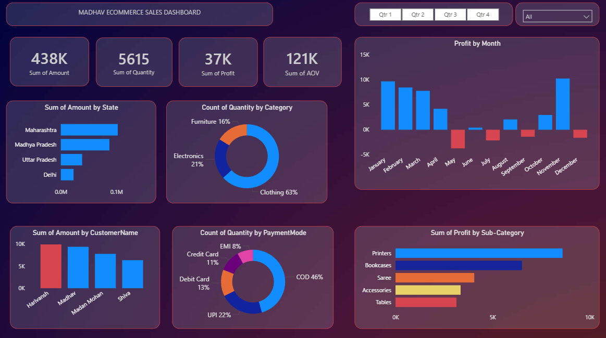

# 📊 Madhav E-Commerce Sales Dashboard

## Project Overview

This project is an interactive E-Commerce Sales Dashboard built using Power BI. It provides insights into sales, profit, quantity, customer performance, payment modes, and product categories to help analyze business performance.

---

## Tools Used

- Power BI
- Power Query
- DAX
- Excel (CSV Dataset)

---

## Dashboard Features

- Sales KPIs
- Profit Analysis
- Sales by State
- Sales by Customer
- Sales by Category
- Profit by Month
- Profit by Sub-Category
- Payment Mode Analysis
- Quarter Filter

---

## Key Metrics

- Total Sales: **438K**
- Total Quantity: **5615**
- Total Profit: **37K**
- Average Order Value (AOV): **121K**

---

## Files

- Madhav Ecommerce Dashboard.pbix
- Dataset (.csv/.xlsx)
- Dashboard Screenshot

---

## Dashboard Preview

(Add your dashboard screenshot here)

---

## Skills Demonstrated

- Data Cleaning
- Data Modeling
- DAX
- Data Visualization
- Business Intelligence
- Dashboard Design
 
  ## Dashboard Preview

